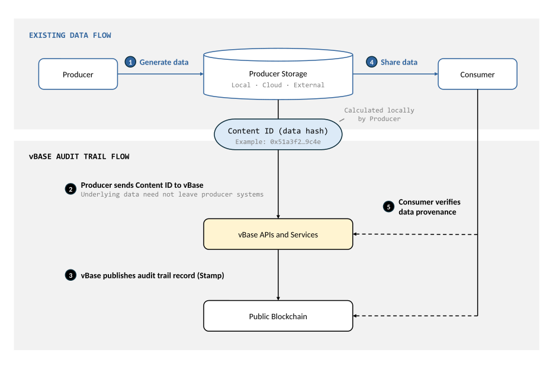

# Technical Architecture

vBase builds an external audit trail layer that sits alongside a data producer's existing production, storage, and delivery processes. Audit trail records are published to an external public ledger, while producers continue generating, storing, and distributing their underlying data through their existing tools and workflows.

For a less technical introduction, see [How vBase Works](../getting-started/how-vbase-works.md).

## Architecture at a Glance

The diagram shows five steps in two parallel flows: the producer's existing data flow and the vBase audit trail flow:

*The vBase audit trail operates alongside the producer's existing data production, storage, and delivery workflow.*

The architecture separates the producer's normal **data flow** from the **audit trail flow**. A Content ID connects the two.

The Content ID is a cryptographic fingerprint calculated deterministically from the underlying data and published as part of each audit trail record. A consumer holding the exact same data can later independently recalculate its Content ID using standard, widely available hashing libraries and match it to the corresponding public audit trail record.

## End-to-End Data Flow

A typical workflow looks like this:

1. **Generate data** — The producer generates and stores data using its existing systems. Storage can be local, cloud-based, or external to the Producer's primary environment.

2. **Send the Content ID to vBase** — The Producer cryptographically hashes the data to calculate a **Content ID** and sends that Content ID to vBase. The underlying data does not need to leave the producer's systems.

3. **Publish the Stamp** — vBase creates a **Stamp** (audit trail record) by publishing the Content ID to a blockchain, linking it to the stamping account's blockchain address and, where applicable, a Collection ID. The Stamp establishes that the Content ID existed **no later than the blockchain publication timestamp**.

4. **Share the data** — The producer distributes the underlying data to consumers through its normal delivery channels. vBase does not need to sit between the producer and consumer or change the producer's existing delivery infrastructure.

5. **Verify data provenance** — A consumer can calculate the Content ID of the data received and compare it with the public audit trail record. Verification can be performed using vBase tools or by independently inspecting the blockchain records, and can happen at any time after Stamp creation.

### Key Implications of This Architecture

Separating the data flow from the audit trail flow has several important consequences:

- **No change required to normal data production, storage, or delivery** — Producers can continue using their existing files, databases, APIs, S3 buckets, SFTP, or other systems. vBase creates audit trail records alongside the existing workflow, without requiring changes to how the underlying data is produced, stored, or delivered.

- **Underlying data need not be sent to vBase** — The Content ID can be calculated within the producer's environment, so only the cryptographic fingerprint needs to enter the audit trail flow.

- **Provenance remains verifiable as data moves** — No special certificate, receipt, or embedded metadata needs to accompany the data. Data can move between consumers, systems, or archives and still be independently verified against its audit trail.

- **Verification does not depend on vBase** — vBase provides convenient verification tools and outputs, but consumers can also validate by independently inspecting the underlying public blockchain records.

## System Components

The architecture can be thought of as three primary layers:

- **Producer and consumer systems** — The files, databases, cloud storage, APIs, models, applications, and delivery infrastructure through which the underlying data is created, stored, and shared.

- **vBase APIs and services** — The Web App, APIs, user accounts, Collection and identity metadata, blockchain transaction submission, record indexing and verification, and optional storage, dashboard, and managed delivery services.

- **Public blockchain** — The external public ledger containing the stamped records. vBase currently uses [Polygon](https://polygon.technology/) as its default public blockchain, while the architecture is designed so that other compatible ledgers can also be used.

vBase's application layer makes the audit trail easy to create and use, while the public blockchain contains the independently verifiable record.

## Record Storage

The Producer stores the underlying data, while the public blockchain contains the independently verifiable audit trail records. vBase's application layer optionally provides identity verification, use-case specific metadata, and other services around those records.

| Information | Location |
|---|---|
| **Underlying data** | Producer* |
| **Audit trail record (Stamp)** | Public blockchain |
| **Application-specific metadata** (optional) | vBase application |

**In the audit trail workflow, the underlying data remains with the Producer. Users may choose to share underlying data with vBase when using optional services such as backup storage, performance dashboards, or managed data delivery.*

For technical information about how vBase audit trail records verify data provenance, see [Verification and Trust Model](verification-and-trust-model.md). For details on how data is shared and processed in specific workflows, see [Privacy and Data Handling](privacy-and-data-handling.md).

## Related Documentation

- [How vBase Works](../getting-started/how-vbase-works.md)
- [Why Public Blockchains?](why-public-blockchains.md)
- [Independent Blockchain Verification](../technical-reference/independent-blockchain-verification.md)
- [Python API Client](../getting-started/api-py-quickstart.md)
- [REST API](../../vbase-django-tools/api/rest-api-user-guide.md)
- [Interactive API Reference](https://app.vbase.com/swagger/)