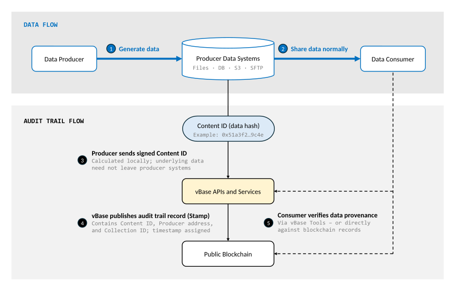

# Technical Architecture

vBase is designed to build an external audit trail layer that sits alongside a data producer's existing production, storage, and delivery systems. Audit trail records are published to an external, publicly accessible ledger, while producers continue generating, storing, and distributing their underlying data through their normal tools and workflows.

For a less technical introduction, see [How vBase Works](../getting-started/how-vbase-works.md).

## Architecture at a Glance

The diagram shows five steps across the normal data flow and the parallel audit trail flow:

<figure>
  
  <figcaption>The vBase audit trail layer operates alongside the producer's existing data production and delivery workflow.</figcaption>
</figure>

The architecture separates the producer's normal **data flow** from the **audit trail flow**. vBase creates a separate, independently verifiable provenance record that sits external to a producer's existing data systems.

## End-to-End Data Flow

A typical workflow looks like this:

1. **Data generation** — Producers continue generating and storing data in their existing systems, such as files, databases, S3 buckets, models, and APIs.

2. **Data sharing** — Producers continue distributing data through their normal channels. The vBase audit trail remains separate from and external to the underlying data.

3. **Content identification** — When the producer wishes to build an audit trail record, the data is cryptographically hashed to produce a **Content ID**. Depending on the workflow, the Content ID can be calculated locally or vBase can calculate it from the underlying content.

4. **Stamp creation and blockchain publication** — vBase creates a **Stamp** (audit trail record) linking the Content ID to the Stamper's blockchain address and, where applicable, a Collection ID. The Stamp is published to a public blockchain, establishing that the Content ID existed **no later than the blockchain timestamp**.

5. **Verification** — A consumer can calculate the Content ID of the data received from the Producer and compare it with the corresponding audit trail records either using vBase tools or by independently inspecting the blockchain records. Verification can happen any time after Stamp creation, and often happens months or years later. 

### Key Implications of This Architecture

Separating the data flow from the audit trail flow has several important consequences:

- **No change required to normal data delivery** — Producers can continue storing and distributing data through their existing files, databases, APIs, S3 buckets, SFTP, or other systems. vBase does not need to sit between producer and consumer's existing sharing workflows.

- **Any holder of the data can verify the audit trail** — Because the audit trail is external to the underlying data, the data can move from one consumer, system, or archive to another multiple times, without losing its provenance. Any holder of the original data can validate its provenance against the public audit trail. No special files,  receipts or metadata need to travel with the data. 

- **Underlying data need not be sent to vBase** — In workflows where the Content ID is calculated locally, only the cryptographic fingerprint enters the audit trail flow. 

## System Components

The architecture can be thought of as three primary layers:

- **Producer and consumer systems** — The existing files, databases, S3 buckets, APIs, models, applications, and delivery infrastructure through which the underlying data is created, stored, and shared.

- **vBase application layer** — The Web App, APIs, user accounts, Collection and identity metadata, blockchain transaction submission, record indexing and verification, and optional storage and reporting services.

- **Public blockchain** — The external ledger containing the core publicly verifiable Stamp records and their timestamps. vBase currently uses [Polygon](https://polygon.technology/) as its default public blockchain, while the architecture is designed so that other ledgers can also be used.

The vBase application layer makes the audit trail easy to create and use, while the public blockchain provides the independently verifiable record.

## On-Chain vs. Off-Chain Information

vBase separates the core public audit trail from underlying data and additional application metadata.

| Information | Location |
|---|---|
| **Core Stamp record** — Content ID, Producer blockchain address, Collection ID (where applicable), transaction ID and timestamp | Public blockchain |
| **Application metadata** — human-readable Collection names and other account metadata | vBase application layer |
| **Identity metadata** — linkage of blockchain addresses to vBase identities and identity verification information | vBase application layer |
| **Underlying stamped content** | Producer and/or optional vBase storage, depending on workflow |

The public blockchain contains the core independently verifiable audit trail, while vBase's application layer adds identity, naming, storage, indexing, and other services around that record.

For more information, see [Verification and Trust Model](verification-and-trust-model.md). For details on when vBase receives or stores underlying content, see [Privacy and Data Handling](privacy-and-data-handling.md).

## Related Technical Documentation

- [Why Public Blockchains?](why-public-blockchains.md)
- [Independent Blockchain Verification](../technical-reference/independent-blockchain-verification.md)
- [Python API Client](../getting-started/api-py-quickstart.md)
- [REST API](../../vbase-django-tools/api/rest-api-user-guide.md)
- [Interactive API Reference](https://app.vbase.com/swagger/)