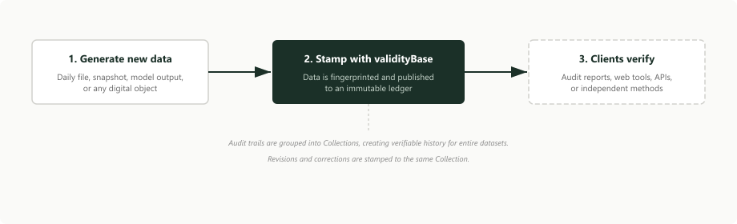

# Data Provider Workflow

Data providers, especially those selling to systematic investors, benefit from a complete, point-in-time dataset history that users can independently validate. See [Why Quants Pay More for Point-in-Time Data](https://www.vbase.com/blog/why-quants-pay-more-for-point-in-time-data/) for more on why this matters.

vBase lets you create a verifiable, point-in-time history for your dataset without changing your production or delivery workflow.

This page builds on concepts covered elsewhere in the documentation. If you are new to the basics, start with [What is a Stamp](/overview/what-is-a-stamp), [What vBase Verifies](/overview/what-vbase-verifies), and [Technical Overview](/deep-dive/technical-overview).

As a quick overview, stamps and collections together allow a data provider to create independently verifiable proof of:

- when specific data releases enter the historical record
- the completeness of the dataset's historical record
- the revision history for a dataset

See [What vBase Verifies](/overview/what-vbase-verifies) for more detail.

## What vBase enables for data providers

### 1. An independently verifiable release history
Every data delivery, revision, and correction is recorded with a tamper-proof timestamp. The result is a complete point-in-time history for each dataset that neither the provider nor vBase can alter after the fact.

### 2. Self-service verification for clients
A data provider's clients can check what they received against the published record themselves — through audit reports, web tools, or APIs — without needing to rely on the data provider's representations. 

### 3. Diligence-ready documentation
During buyer due diligence, the verifiable history serves as evidence of point-in-time controls and revision handling. For enterprise deployments, vBase can provide additional attestation support.

## Where vBase sits in the pipeline

vBase typically sits at the publication step of the provider’s existing pipeline. The provider continues to generate and deliver data as usual. vBase adds a data stamping step at the end. 

In many workflows, stamping does not require exposing the underlying data. Audit trails can be created from data fingerprints rather than raw data.

## Standard stamping workflow

A standard workflow usually looks like this:

1. **Generate new data**  
   This may be a daily file, an intraday snapshot, a weekly archive, a model output, or any digital object. 

2. **Stamp the release at publication**  
   The data is fingerprinted, and the fingerprint is sent to vBase. vBase publishes the fingerprint to an immutable ledger, creating a publicly verifiable audit trail. Audit trails are grouped into collections to create verifiable history for entire datasets. 

3. **Enable verification of published data, and data history**  
   Data provider's clients can verify individual deliveries or, where relevant, broader dataset history using vBase tools or independent verification methods.

## What should be stamped

The right object to stamp is the one that will be delivered to clients as part of the historical data for your product. 

Common examples include:
- a daily flat file
- an intraday snapshot
- a weekly or monthly report
- a model output file
- a database export
- a pull from an API 

The goal is to stamp the data whose history your clients will want to validate to be sure the history they're seeing is point-in-time and complete. 

## Common questions

### Do I need to change my delivery pipeline?
Usually not. vBase is intended to sit alongside the provider’s existing production and delivery workflow.

### What is the client-facing output of this workflow?
Clients get a way to verify what they received, when it entered the record, and how later revisions were handled. Clients can use vBase audit reports, web tools, APIs, or the blockchain record itself to see validate data history. 

### Does validityBase need access to my raw data?
Not necessarily. In many workflows, only the data's fingerprint (hash) is used to build audit trails. 

### Should revisions be stamped too?
Yes. Revisions and corrections should generally be stamped. 

### Does validityBase provide support in buyer diligence?
Yes. The verifiable history is the foundation. In some enterprise deployments, validityBase can also provide additional support during buyer diligence, including verification support, attestation, and explanatory materials around point-in-time controls and revision handling.

### What is a Collection?
A Collection is the publicly verifiable record for all data stamped and associated with a particular dataset. In most cases, each dataset product should have its own collection. 

### How should revisions, corrections, and backfills be handled?
Record them as new stamped data in the same Collection.

## Related docs

- [What is a Stamp](/overview/what-is-a-stamp)
- [What vBase Verifies](/overview/what-vbase-verifies)
- [Technical Overview](/deep-dive/technical-overview)
- [Verification Methods](/deep-dive/verification-methods)
- [Stamping Best Practices](/deep-dive/dataset-commitments)
- [REST API User Guide](/rest-api/rest-api-user-guide)
