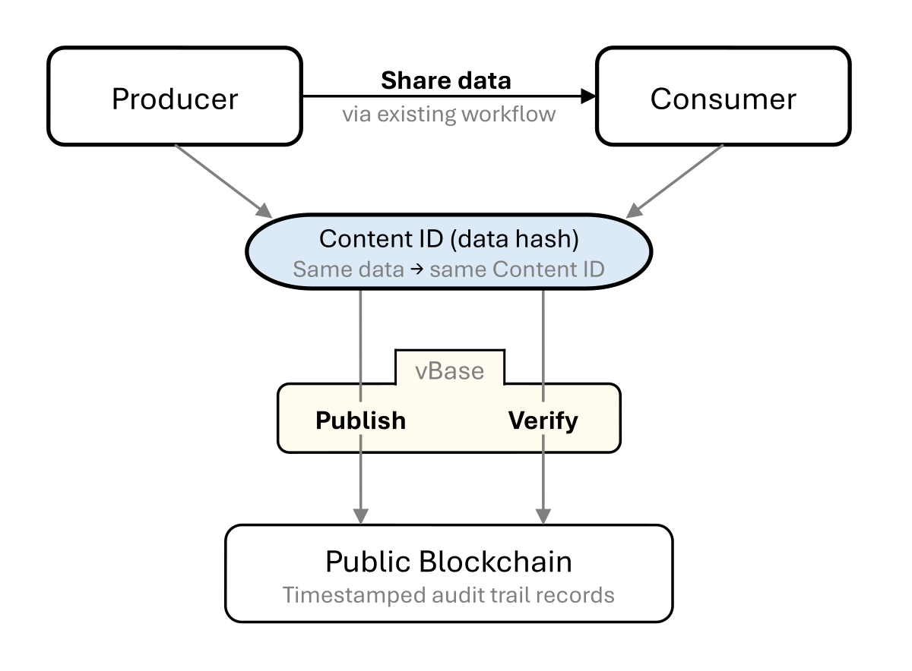

# How vBase works

vBase creates independently verifiable audit trails that show **what data existed and by when**.

As a data producer generates data over time, vBase creates audit trail records (**Stamps**) for the data and publishes these Stamps to a public blockchain. Related Stamps can be grouped into **Collections**, so a full dataset, trading strategy, or other body of work has a single audit trail.

Later, vBase lets data consumers compare the historical data they receive with the public audit trail to verify that the data corresponds to audit trail records that were published over time.

**The underlying data itself is not published to the blockchain and need not be shared with vBase in order to create the audit trail.**

## Building and verifying an audit trail

vBase leaves the producer's existing data sharing workflow unchanged while creating an external public audit trail that consumers can use for provenance verification.

<figure>
  
  <figcaption>Producers share data through their existing workflows while vBase publishes and helps verify the corresponding public audit trail records.</figcaption>
</figure>

### Building the audit trail

As data is produced, vBase helps producers publish a **Stamp** for each update or release. Each Stamp contains a **Content ID**: a cryptographic fingerprint (hash) that identifies the underlying data without revealing it. 

When a Stamp is published to a public blockchain, the resulting record receives a publicly verifiable publication timestamp. Over time, these records create a point-in-time audit trail showing what data existed by each record's timestamp.

Because Stamps are published to a public ledger, their contents and timestamps can be inspected independently of vBase. vBase provides tools and services that make building and verifying audit trails easy, but the underlying audit trail does not depend on vBase as the source of truth.

### Verifying the audit trail

The same data always produces the same **Content ID**. To verify data against the audit trail, the consumer recalculates its Content ID, and looks up matching Stamps either through vBase tools or directly via the blockchain records. 

When the Content IDs match, the consumer can establish that the data they're reviewing is the same data represented by the producer's Stamp.

At the Collection level, consumers can verify that a complete dataset matches the audit trail records in a Collection. This can establish both the point-in-time integrity of individual records and the completeness of the presented history relative to the full set of Stamps in the Collection.

## What the audit trail can establish

Depending on how vBase is used, the audit trail can provide independently verifiable evidence of:

- **Timing** — what data existed and by when
- **Integrity** — whether the data being reviewed matches the data represented by an earlier Stamp
- **Completeness** — whether a dataset or other history corresponds one-to-one to the public audit trail records in a Collection
- **Context** — other audit trails associated with the same Stamper address are also public, this helps consumers assess the broader set of datasets, strategies, or other products that identity has recorded

Because the audit trail uses standardized publicly accessible records, the same historical evidence can be verified by different consumers at different times.

For a more detailed explanation of what vBase verification establishes and its limits, see [Verification and Trust Model](../concepts/verification-and-trust-model.md).

## Next steps

- [Example Use Cases](example-use-cases.md) — see how vBase is used with datasets, trading strategies, research, models, and other data products
- [Stamps and Collections](../concepts/stamps-and-collections.md) — how vBase audit trails are built and organized
- [Choose How to Use vBase](choose-how-to-use-vbase.md) — start creating an audit trail
- [Technical Architecture](../concepts/technical-architecture.md) — how vBase fits into existing data workflows
