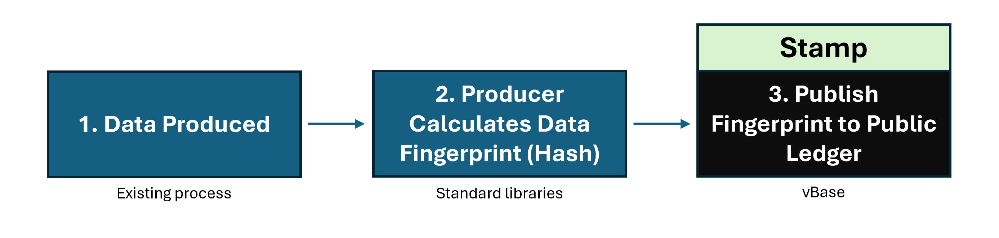
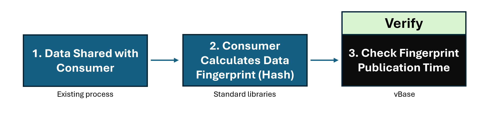

# How vBase Works

vBase creates independently verifiable audit trail records that show **what data existed and by when**.

The basic process is simple: vBase publishes a cryptographic fingerprint of a file or other digital object to a public blockchain, thus creating an audit trail record (Stamp) with a publicly verifiable timestamp. Anyone with the relevant data can later compare it with the corresponding audit trail records.

Related records can be grouped into **Collections**, making it possible to verify the history of a dataset, strategy, portfolio, research process, or other body of work rather than only individual objects.

**The underlying data itself can remain fully private in building an audit trail. It does not need to be published or sent to vBase.**

## The vBase Process

<figure>
  
   <figcaption>The stamping process. Publication to the public ledger gives the Stamp an independently verifiable timestamp — one that doesn't depend on trusting vBase or the data producer.</figcaption>
</figure>

### 1. Generate and store data normally

vBase does not replace the systems used to create, store, or distribute data. Rather, it creates a layer of external metadata that validates key elements of the data's provenance. 

Producers can continue using their existing files, databases, S3 buckets, APIs, and data-delivery workflows. vBase adds an independent audit trail alongside those systems.

### 2. Create a Content ID

To create an audit trail record, vBase uses a cryptographic fingerprint, or **hash**, of the data. vBase calls this fingerprint a **Content ID** and uses NIST-standard [SHA3-256](https://en.wikipedia.org/wiki/SHA-3) hashes by default.

A Content ID is a 256-bit hexadecimal value, for example:

`0xf99f54f22ae53ed63d4afe199a1de5fe8981d38c50da0302b8104f3d279531c2`

Changing even a single byte of the underlying data produces a different Content ID. This links audit trail records to the data without publishing the data itself.

Depending on the workflow, vBase can calculate the Content ID from the data or receive a Content ID calculated locally by the data producer. This enables workflows in which the underlying data is never sent to vBase.

### 3. Create a Stamp

A **vBase Stamp** is an individual audit trail record for a file or other digital object.

A Stamp links:

- The **Content ID** of the stamped data
- The **blockchain address** associated with the vBase account that signs the Stamp
- A publicly verifiable **publication timestamp** for the audit trail record
- An optional **Collection ID** linking the Stamp to a larger audit trail

vBase records the Stamp on a public blockchain. Because the record is stored on a public ledger rather than only in a database controlled by the data producer or vBase, it can be independently inspected later.

A Stamp provides evidence that the exact data represented by its Content ID existed **no later than the published blockchain timestamp**.

Each Stamp is associated with the blockchain address of the stamping account. Where available, vBase also links that address to vBase profile and identity information, helping verifiers understand which producer created the record.

### 4. Share data normally

vBase does not need to change how data is distributed.

Producers can continue sending files, delivering data through APIs, granting S3 access, or using other existing delivery methods. The vBase audit trail remains separate from the data itself.

### 5. Verify the history

<figure>
  
     <figcaption>The stamping process. Publication to the public ledger gives the Stamp an independently verifiable timestamp — one that doesn't depend on trusting vBase or the data producer.</figcaption>
</figure>

vBase is designed to make verification both **easy to perform** and **credible to rely on**.

A consumer can use vBase's Web App, APIs, or other verification tools to check historical data against its audit trail. The tools automate the technical steps: calculating the data's Content ID, locating matching audit trail records, and displaying the associated timestamp, identity, and Collection information.

The underlying verification process is straightforward:

1. Calculate the data's Content ID using the same hashing method
2. Locate the corresponding vBase audit trail record
3. Compare the Content ID, blockchain timestamp, identity, and Collection information

If the Content ID matches, the consumer knows that the data being reviewed is exactly the same as the data represented by the earlier record.

At the Collection level, a consumer can validate that a dataset or set of objects corresponds exactly to the Collection audit trail, with matching timestamps and a one-to-one correspondence between data objects and audit trail records in the Collection. 

Importantly, this is not a bespoke verification process created for a particular producer or transaction. vBase uses a standardized, auditable process based on public records and consistent verification methods. The same evidence can therefore be checked by different consumers, at different times, using vBase tools or—where desired—by inspecting the underlying public audit trail records directly.

This makes verification easier to repeat and scale: a producer can build one credible audit trail, and future consumers can independently verify it.

## How Collections Work

A **Collection** groups related Stamps under a shared identifier.

For example, a Collection might represent:

- A dataset and its successive updates
- A trading strategy or signal history
- A portfolio history
- A research project
- A model's historical outputs

When data is stamped as part of a Collection, the audit trail records the relationship between that data and the Collection.

This allows users to evaluate not only individual records, but also the history of the Collection as a whole. For example, Collection verification can compare a submitted archive with the records previously stamped into a Collection and identify items that are missing or extra relative to that recorded history.

Collections are optional. A Stamp that is not associated with a Collection is still independently verifiable.

## What the Audit Trail Can Establish

Depending on how vBase is used, the resulting audit trail can provide independently verifiable evidence of:

- **Timing** — what data existed and by when
- **Integrity** — whether the data is unchanged from when its audit trail record was created
- **Completeness** — whether the dataset, time series, or strategy being presented matches the history previously recorded in its Collection
- **Presentation context** — the other audit trails recorded under the same vBase identity, giving consumers visibility into the broader set of strategies, datasets, or models recorded by that identity and helping them assess selective presentation

## What vBase Does Not Verify by Itself

vBase makes it possible to compare a dataset to its point-in-time history. It does not determine whether the underlying data, prediction, model, or strategy is useful or valuable.

A vBase audit trail does not, by itself, establish:

- Whether the underlying data is true or accurate
- The exact moment the data was originally created
- Authorship beyond the identity associated with the stamping account
- Activity conducted outside the relevant Collection or vBase identity

These distinctions are important: vBase builds independently verifiable evidence that a particular dataset or trading strategy corresponds exactly to its point-in-time history, while leaving the evaluation of the data itself to the consumer.

## Why Use vBase?

Anyone can calculate a cryptographic hash and publish it to a public blockchain. Doing so directly, however, typically requires managing blockchain wallets, transaction fees, smart contracts, and infrastructure for retrieving and interpreting the resulting records.

vBase handles that complexity and provides practical tools for creating, organizing, and verifying audit trails through its Web App, APIs, and developer tools.

Stamping data or trading strategies creates a useful asymmetry: a complete, point-in-time stamped history is easy for a producer to build and impossible to generate after the fact — so someone with predictive data or strategies can send an inexpensive but highly credible signal about their work.

For more detail on why vBase uses a public blockchain, see [Why Blockchains?](why-blockchains.md).

## Next Steps

- [Use the vBase Web App](../web-tools/web-app-overview.md)
- [Learn how to create a Stamp](../web-tools/how-to-use-vbase-stamper.md)
- [Learn how to verify data](../web-tools/how-to-use-vbase-verify.md)
- [Start with the Python API Client](../getting-started/api-py-quickstart.md)
- [See example use cases](example-use-cases.md)
