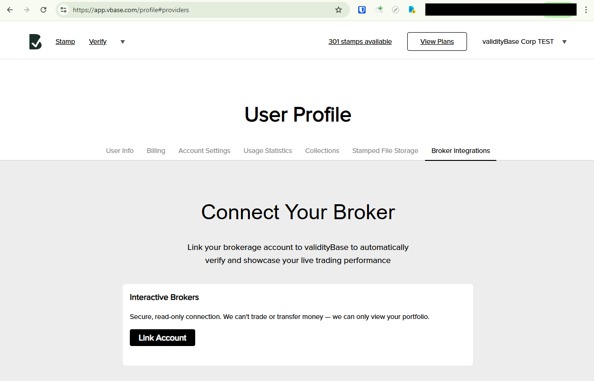
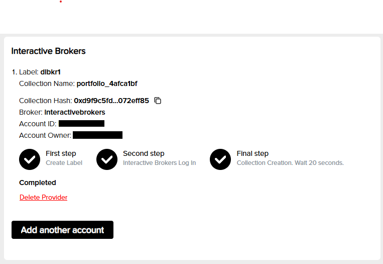

# Connect Interactive Brokers (IBKR)

Connect your IBKR account to validityBase to securely **import positions and cash balances** to generate a **verifiable, point-in-time track record** directly from your account activity.  

> **Note:** validityBase access is strictly **read-only**. We cannot place orders or move funds in your account.  

## Step-by-step

### 1) Sign in to validityBase & navigate to Broker Integrations
- Visit [**app.vbase.com**](https://app.vbase.com/) and sign in (or create an account).
- Click your display name in the upper right corner and select [**User Profile**](https://app.vbase.com/profile).
- In your Profile, select [**Broker Integrations**](https://app.vbase.com/profile#providers) from the top menu.

### 2) Setup Account Link
- Click **Link Account**.
- Enter a label (to help you identify the account later).
- Click **Next**.

### 3) Link your IBKR account
- You’ll be redirected to the IBKR authentication portal.
- Choose whether to connect a **Paper** or **Live** account.
- Enter your IBKR **username** and **password** and complete 2FA as necessary
- Review and approve the requested **read-only** permissions (account, positions, trades, balances).
- You’ll then be redirected back to validityBase.

### 4) Confirm the connection
- Back in validityBase, you’ll see a **Connection successful** message and your account details.  

- Occasionally the IBKR authorization can fail. If so, delete the provider and repeat steps 2–3.  
- If you manage multiple IBKR sub-accounts under one login, email **portfolios@vbase.com** so we can configure the correct account(s).  

### 5) Set up your dashboards
Email **portfolios@vbase.com** with the following:  
- Your strategy name  
- A short description of your strategy (100–200 characters)  
- A short description of yourself as the dashboard creator (100–200 characters)  
- An optional contact email  

We will reply back with your live dashboard link.

See this [example dashboard](https://portfolios.vbase.com/?sym=ASGSP5DR) to understand how the information appears.  

## Common issues & fixes

**No data after linking**  
- Within 2 minutes you should see your first portfolio stamp in [Stamped File Storage](https://app.vbase.com/profile#user_data_storage). If nothing appears, retry the link.  

**Multiple sub-accounts**  
- For corporate IBKR accounts with multiple sub-accounts, link as usual, then email **portfolios@vbase.com** specifying which sub-account(s) you’d like connected.  

## FAQs

**Is this trading access?**  
No. Access is **read-only**—we cannot trade or move funds.  

**How often do you sync?**  
We sync automatically each day around **3:15 pm EST**.  

**What gets stamped for verification?**  
Your portfolio weights are cryptographically stamped. Copies are stored in your [Stamped File Storage](https://app.vbase.com/profile#user_data_storage). Note the vBase track record is built on portfolio weights, not trade history. 

**Can I disconnect later?**  
Yes. Go to **Profile → Broker Integrations → IBKR → Disconnect**. You can also ask us to delete your dashboard link. 

**Does this replace an audit?**  
validityBase provides an **independently verifiable, cryptographic validation** of your IBKR track record. Many managers use this to share performance transparently and reduce reliance on costly audits for marketing. 

## Need help?
If you encounter issues, contact **portfolios@vbase.com** with:  
- Your validityBase email  
- IBKR account type (individual, advisor, master/sub)  
- A brief description and the time you attempted the link  
- Any relevant screenshots (no sensitive information)  