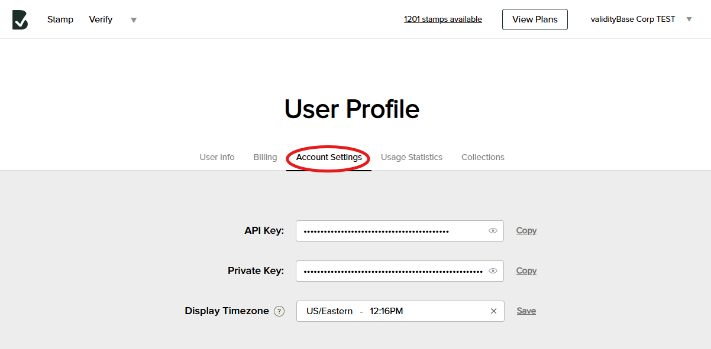

To sign up for a free vBase account, follow the following steps: 

1. Go to [https://app.vbase.com/accounts/signup/](https://app.vbase.com/accounts/signup/) and input the required Sign Up information
2. Verify your e-mail by clicking the confirmation link sent to you after you Sign Up
3. Go to [app.vbase.com](https://app.vbase.com/) and login using your chosen e-mail/password

You are now logged in and ready to start using vBase. Once logged in, you can [Make Stamps](../web-tools/how-to-use-vbase-stamper.md), [Verify Collections](../web-tools/verify-a-collection.md) and more. 

You can also access your API key and Private Key than you can use within our various SDKs. To find this information
1. Click on the down arrow in the upper right hand corner
2. Select "User Profile" from the drop-down menu
3. Select the "Account Settings" tab under User Profile

