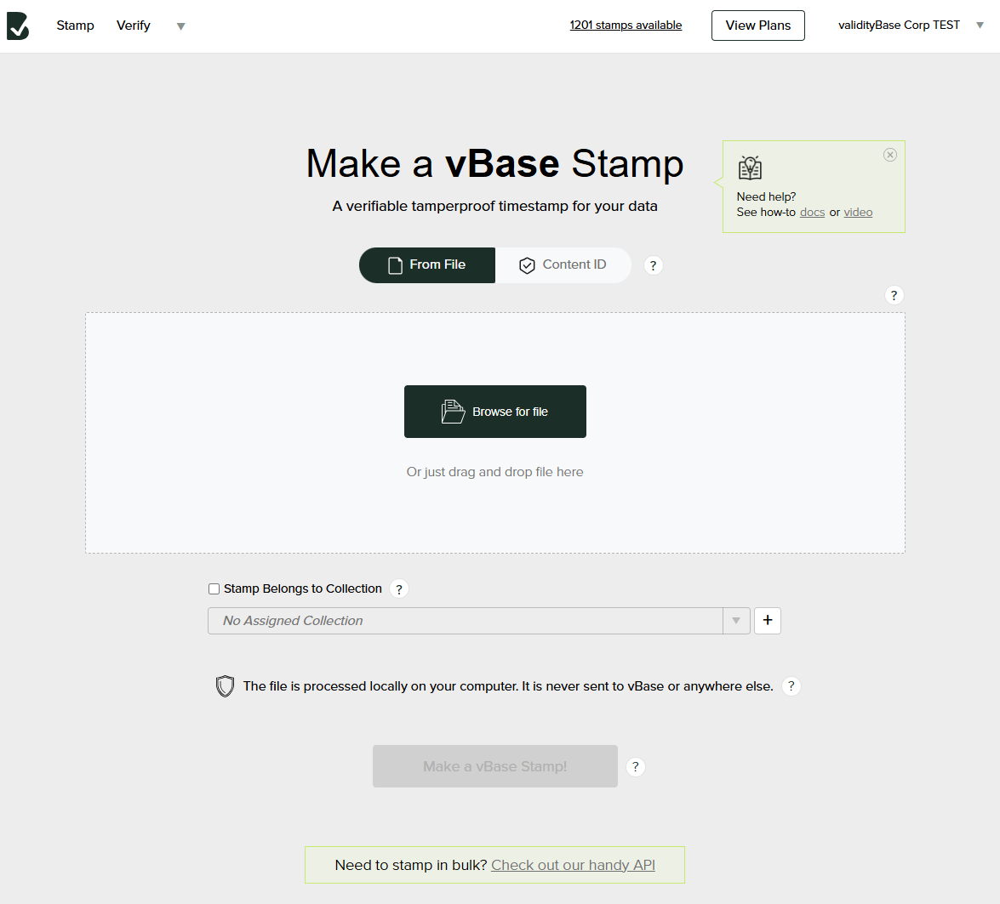
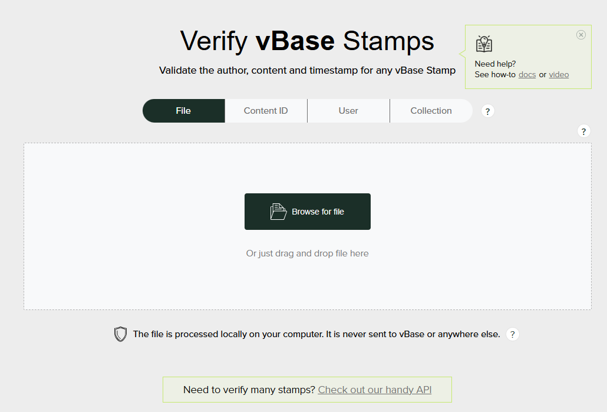

## Sign Up for A Free Account

To sign up for a free vBase account, follow the following steps: 

1. Go to [https://app.vbase.com/accounts/signup/](https://app.vbase.com/accounts/signup/) and input the required Sign Up information
2. Verify your e-mail by clicking the confirmation link sent to you after you Sign Up
3. Go to [app.vbase.com](https://app.vbase.com/) and login using your chosen e-mail/password

You are now logged in and ready to start using vBase. 

## Important Note

vBase Stamps create a permanent record associated with your account. We suggest using the first account you create to play around with the application and run any necessary testing, and then to create a new account once you are ready to go live with creating verifiable provenance for your critical data. 

An alternative approach is to create a collection called "TEST" and place your test stamps there. 

## Navigating the Web Application

The vBase Web Application allows Stamp, Verify and other related operations to be done quickly and easily. Below is a quick orientation around the app. 

### Stamp

The Stamp interface is accessed by clicking the Stamp link in the upper left hand corner of the application, or by going directly to [https://app.vbase.com/stamp/](https://app.vbase.com/stamp/). 

Once there, you'll reach the Stamp main page, which looks like this: 

 

On this screen, you can: 

- Stamp a File
- Stamp a ContentID

For more information on what it means to make a stamp, please see [How vBase Works](../welcome/how-vbase-works.md) and [What is a Stamp](../welcome/what-is-a-stamp.md).  

#### Stamping a File

Drag a file into the white box to be stamped, or browse for a file to Stamp by clicking the black "Browse for File" button. 

You can also indicate that a Stamp belongs to [a particular collection](../welcome/what-is-a-stamp.md#what-is-a-vbase-collection) by checking the associated box. 

App Shortcut: [https://app.vbase.com/stamp/#file](https://app.vbase.com/stamp/#file)  

#### Stamping a ContentID 

If you prefer, rather than stamping a file, you can specify a contentID to stamp directly. You can do this by clicking the ContentID button just above the white box and inputting the contentID. 

**Stamping a contentID is an advanced feature.** If you do not safely create and keep a pre-image of your contentID, it will be impossible to verify it in the future.   

App Shortcut: [https://app.vbase.com/stamp/#cid](https://app.vbase.com/stamp/#cid)  

### Verify

The Verify interface is accessed by clicking the Verify link in the upper left hand corner of the application, or by going directly to [https://app.vbase.com/verify/](https://app.vbase.com/verify/). 

Once there, you'll reach the Verify main page, which looks like this: 

 

On this screen, you can: 

- Verify a File
- Verify a ContentID
- Verify a User
- Verify a Collection  

#### Verifying a File 

Verifying a file means checking when the hash (aka ContentID) of this file was previously published, by whom, and belonging to which collection (if any). 

To Verify a File, drag the file into the white box OR select a file from your system by clicking "Browse for File". 

Your browser will calculate the contentID of the file you seek to verify, and then check with vBase whether whether/when any prior stamps were made with this contentID.

App Shortcut: [https://app.vbase.com/verify/#file](https://app.vbase.com/verify/#file)  

#### Verifying a ContentID

Some people may prefer to validate contentIDs directly rather than using the vBase Verify app to calculate a file's contentID. To do this

1. Click the "Content ID" button above the white box in the Verify app. 
2. Calculate the content ID of your data object locally (this is usually a SHA3-256 hash)
3. Input the content ID into the form to look up when/whether it was previously stamped. 

App Shortcut: [https://app.vbase.com/verify/#cid](https://app.vbase.com/verify/#cid)  

#### Verifying a User

To look up the Stamp History for a particular user ID, display name or blockchain address, click the User button above the white box or use the [App Shortcut](https://app.vbase.com/verify/#user) below. 

The output of this search will show all the Stamps and Collections previously made by the user. 

App Shortcut: [https://app.vbase.com/verify/#user](https://app.vbase.com/verify/#user)  

#### Verifying a Collection

Verifying a Collection compares all the cids of an archive to those previously Stamped as part of a vBase Blockchain Collection. If all the cids match, the archive will show as valid, and will display any difference in timestamp between the blockchain record, and the timestamps asserted in the Archive. 

App Shortcut: [https://app.vbase.com/verify/#collection](https://app.vbase.com/verify/#collection)

<!-- Note: To learn how to create a verifiable collection, see [How to Build a Collection](../use-case-samples/build-a-verifiable-archive.md) -->    

<!-- ### User Profile -->

## Using the vBase API

In the vBase App User Profile, you can access your API key and Private Key, which you can use within our various SDKs. To find this information
1. Click on the down arrow in the upper right hand corner
2. Select "User Profile" from the drop-down menu
3. Select the "Account Settings" tab under User Profile

 

 

- See Quickstart
- SDKs

