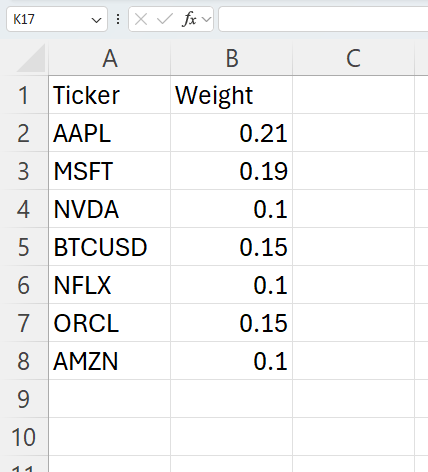

# Building a Live Ticker for your Account, Fund or Paper Strategy

## Introduction

validityBase is a trusted platform for building shareable live global tickers for any trading strategy. 

vBase creates a point-in-time record of your portfolios to build a live Ticker. These portfolios are saved and then used as the basis for calculating live investment performance dashboards for your strategy. 

This guide will walk you through the process of getting a live verified vBase Ticker for your strategy.  

## Steps to Build a Live Verified Track Record

### Step 1: Generate a CSV of your **Current** Portfolio

vBase ingests portfolio data from simple CSVs. Below is an example of a portfolio file. Your file should follow this format, using any widely recognized SEC Master for ticker symbols.

Use this format to generate a CSV file of your current portfolio. 

[Example Portfolio CSV File](https://github.com/validityBase/docs/releases/download/Example_Portfolio/Example_Portfolio_CSV.csv)

  

### Step 2: First-time Setup

1. Go to [app.vbase.com](https://www.vbase.com/)
2. If you don't yet have an account, register for a free account by clicking [Create an Account](https://app.vbase.com/accounts/signup/) in the upper right and following the registration process. 
3. Sign in to your vBase Account
4. Go into your user profile, click the Collections tab. Shortcut: [https://app.vbase.com/profile/#collections](https://app.vbase.com/profile/#collections) 
5. Create a collection name for the strategy you plan to stamp. This is the strategy name that will be visible publicly when you share your live ticker. 
  

### Step 3: Stamping your Portfolio

Stamping your portfolio means calculating the digital fingerprint of the CSV file you created in Step 1,  and publishing that fingerprint to a public blockchain. By publishing the fingerprint, you assign an independently verifiable timestamp to your portfolio. 

vBase allows you to stamp via API, Excel or our web application. This guide will explain how to create Stamps in the web application. See these docs for instructions to use our brokerage integrations, our [API](../../vbase-py-samples/quickstart.md) or our [Excel tools](../../vbase-cs/workbook.md). 

1. Go to Stamp page - [https://app.vbase.com/stamp/](https://app.vbase.com/stamp/)
2. Load your portfolio CSV for a particular strategy into the Stamper dialog box
3. Check the box that this Stamp belongs to a Collection
4. Select from the Collection dropdown menu the name of your Strategy
5. Click Make a Stamp
6. Generate and Stamp a new CSV of your portfolio on a regular cadence or each time you have a major rebalance 
  

**Stamping Notes:** 

- A digital fingerprint is a SHA3 256-bit [cryptographic hash](https://csrc.nist.gov/glossary/term/cryptographic_hash_function), which provides a unique identifier for your portfolio CSV file without disclosing its contents.

- If you ever wish to confirm your Portfolio CSV was properly Stamped, simply load it into the [vBase Verify](https://app.vbase.com/verify/) interface

- By default, the web application saves a copy of any stamped data. To turn this off and stamp data privately, please update your preference in your User Profile under [Account Settings](https://app.vbase.com/profile/#account_settings)
  

### Step 4: View and Share your Live Strategy Ticker! 

vBase uses your point-in-time portfolios to generate a ticker and live set of verified dashboards for your strategy. 

Your dashboards will be displayed at https://portfolios.vbase.com/?sym=YOUR_TICKER

To get your ticker and dashboard link, please e-mail us at [hello@vbase.com](mailto:hello@vbase.com) and let us know the Collection Name under which you are stamping your strategy. 
  

## Best Practices
- **Ensure Accuracy:** Provide complete and accurate data to avoid discrepancies.
- **Use Standard Ticker SEC Master:** vBase uses tickers to look-up price data for your portfolio
- **Review Regularly:** Periodically review your dashboards to ensure data matches your expectations and cross-check against internal records
  

## Conclusion

validityBase allows anyone to quickly, easily, and cost-effectively build globally credible, live track records with shareable beautiful dashboards for their trading and model portfolios. 