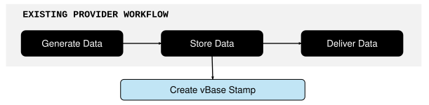

# Data provider workflow

Data providers, particularly those selling predictive data to investors, benefit from showing that their dataset's history is a complete, point-in-time representation of what the consumer would have received live. See [Why Quants Pay More for Point-in-Time Data](https://www.vbase.com/blog/why-quants-pay-more-for-point-in-time-data/) for more on why this matters.

A vBase audit trail gives data providers independently verifiable evidence that data is point-in-time and complete, and enables consumers to quickly match the point-in-time audit trail to the underlying data. 

## How an audit trail is created

As a provider stores or delivers data, vBase creates and publishes **Stamps**, publicly timestamped audit trail records that contain the data's fingerprint (Content ID). 

**These Stamps do not contain the underlying data itself** and audit trails can be built without changing how providers produce, store, or deliver data. 

<figure>
  
  <figcaption>The provider's existing data flow runs alongside the vBase audit trail flow.</figcaption>
</figure>

If you are new to vBase, see [How vBase Works](../getting-started/how-vbase-works.md) and [Stamps and Collections](../concepts/stamps-and-collections.md).

For what an audit trail enables a data consumer to verify, see [What the Audit Trail Can Establish](../getting-started/how-vbase-works.md#what-the-audit-trail-can-establish).

## One-time setup

### 1. Create a vBase account

Create a vBase account at [https://app.vbase.com/accounts/signup/](https://app.vbase.com/accounts/signup/). The account establishes the audit trail's creator identity. 

For a step-by-step guide, see [Create a vBase Account](../getting-started/create-a-vbase-account.md).

### 2. Create a Collection for the dataset

Create a **Collection** for each dataset or product whose history will form a single audit trail.

Create Collections [via the vBase Web App](https://app.vbase.com/profile/#collections) or [the API](../getting-started/api-py-quickstart.md).


## Ongoing workflow

### 1. Stamp each update or revision

#### How to stamp

For most recurring data pipelines, we recommend automating stamping through the [Python API Client](../getting-started/api-py-quickstart.md) or [REST API](../../vbase-django-tools/api/rest-api-user-guide.md).

Other options include the browser-based [vBase Web App](../web-tools/web-app-overview.md) and managed workflows using email, S3, SFTP, or other integrations.

See [Choose How to Use vBase](../getting-started/choose-how-to-use-vbase.md) for an overview of available stamping methods and interfaces.


#### What to stamp

A properly built audit trail answers: **Had the data consumer been receiving this dataset live all along, what would they have seen at each point in time?**

Stamp the production data a consumer would actually have received at that point in time: a file, a full dataset snapshot, a model, or another digital object. Create the Stamp as close as possible to the time that the data is stored or delivered. The Stamp's timestamp shows by when the data was available, so earlier is better.

Stamp every release, revision, and correction for the dataset using the same Collection. For example:

```text
Dataset: DAILY-DEMAND-DATA

Jan 5   Production release → Stamp A | Collection: DAILY-DEMAND-DATA
Jan 6   Production release → Stamp B | Collection: DAILY-DEMAND-DATA
Jan 7   Jan 5 revision     → Stamp C | Collection: DAILY-DEMAND-DATA
Jan 7   Production release → Stamp D | Collection: DAILY-DEMAND-DATA

All Stamps share the same stamping address and Collection
```

Together, these Stamps form the point-in-time audit trail for the `DAILY-DEMAND-DATA` dataset.

For more stamping best practices, see [Building a Verifiable History](../concepts/building-a-verifiable-history.md).


### 2. Keep an exact copy of the stamped data

An audit trail can only be verified against an exact copy of the data. If no exact copy of stamped data is available, the Stamps will still exist, but they cannot be matched to the underlying data. 

In many managed workflows vBase stores a backup copy of each stamped object. If the underlying data is not stored with vBase, providers should save the stamped content themselves. 


### 3. Share the audit trail with consumers

Once the audit trail is accumulating records, the provider can share it with data consumers as part of diligence.

Consumers can either use vBase tools or inspect audit trail records independently to compare a dataset with its public audit trail and verify that the data matches the audit trail records, thus verifying that the dataset is point-in-time and complete. 

Providers that want additional support can also use vBase's managed verification services and third-party verification reports.

See [How to Use vBase Verify](../web-tools/how-to-use-vbase-verify.md) for the verification workflow and [Verification and Trust Model](../concepts/verification-and-trust-model.md) for how to verify datasets and what the resulting verification establishes.


## Common questions

### Do I need to change my production or delivery pipeline?

Usually not. vBase operates alongside the provider's existing production, storage, and delivery workflow. Data can continue to be generated and distributed through the same systems used today.

### Does vBase need access to my underlying data?

No. Providers can build and verify audit trails using only Content IDs, without sharing data with vBase. In many managed workflows, however, vBase saves a backup copy of the data to support managed verification and delivery services.

See [Privacy and Data Handling](../concepts/privacy-and-data-handling.md) for more info. 

### Does vBase provide support for verification?

Yes. vBase provides tools that consumers can use to verify datasets against their audit trails.

For users who want additional support during diligence or verification, vBase can also provide managed verification services and dataset-specific point-in-time integrity reports.

Contact [support@vbase.com](mailto:support@vbase.com) for more information.


## Learn more

- [Building a Verifiable History](../concepts/building-a-verifiable-history.md) — best practices for deciding what and when to stamp
- [Stamps and Collections](../concepts/stamps-and-collections.md) — how vBase audit trails are organized
- [Choose How to Use vBase](../getting-started/choose-how-to-use-vbase.md) — available stamping methods and interfaces
- [Private Stamping with Delayed Reveal](private-stamping.md) — workflows where data is stamped before it is disclosed
- [Technical Architecture](../concepts/technical-architecture.md) — how the audit trail fits alongside existing production, storage, and delivery systems