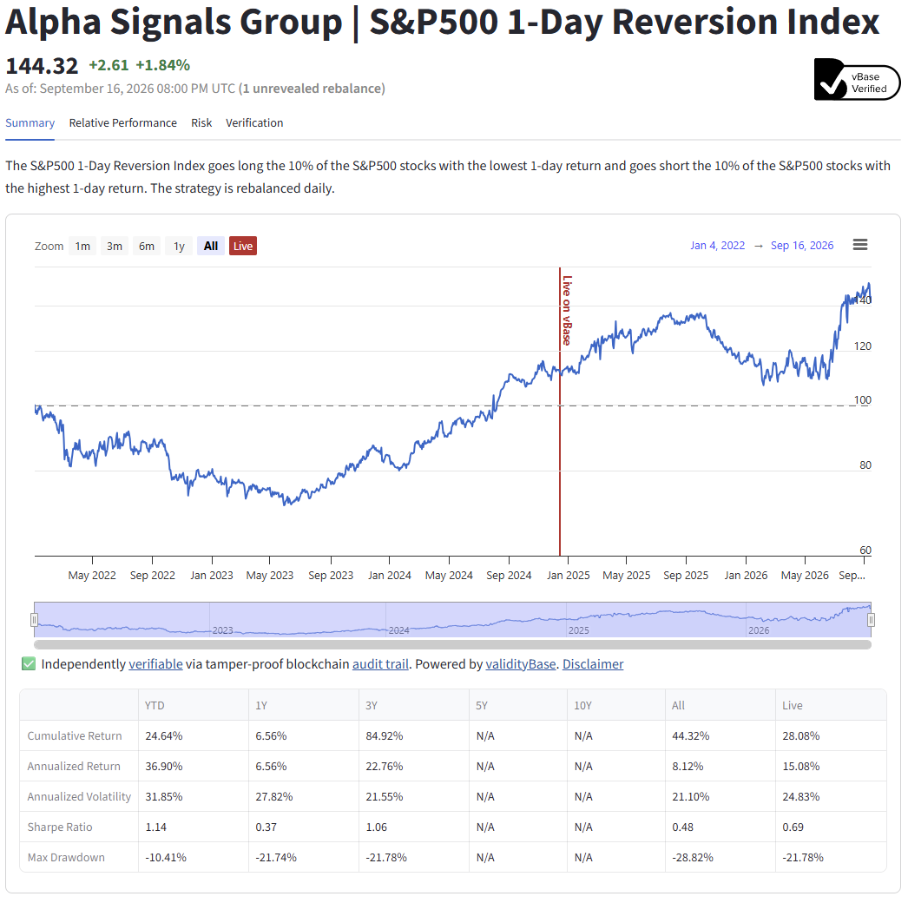

# Verified investment track records

Investment managers, researchers, and signal producers can use vBase to build independently verifiable track records for trading strategies and signals.

A vBase audit trail enables allocators to quickly validate that a historical track record is based on the **complete**, **unrevised** set of **publicly timestamped** strategy outputs. vBase also surfaces other audit trails associated with the same producer, providing context around potential selective presentation.

The approach works across strategies and asset classes, but is not designed for high-frequency trading workflows that require recording large numbers of sub-second events.

For supported asset classes such as equities, commodities, futures, and crypto, vBase can also build live, shareable strategy tearsheets from verified portfolio histories, such as [ASGSP5DR](https://portfolios.vbase.com/?sym=ASGSP5DR).

If you are new to vBase, see [How vBase Works](../getting-started/how-vbase-works.md) and [Stamps and Collections](../concepts/stamps-and-collections.md).

## Choose what kind of track record you want to build

As a strategy generates outputs — such as portfolio weights, trades, or model parameters — the producer stamps those outputs into a **Collection**, creating a point-in-time audit trail.

Possible track-record representations are:

- **Portfolio weights**
- **Trades**
- **Other strategy outputs**

Choose the representation that best matches what a broker or index calculator would have received live. The stamped data should naturally support calculation of investment performance. A strategy can maintain more than one type of track record audit trail where useful.


### Portfolio track records

Stamp portfolio weights or holdings at each rebalance or update.

**Use this representation if you want vBase to build a live performance tearsheet.**

See [Stamping a Portfolio](stamping-portfolios.md) for the required format and implementation guidance.

### Trade and other strategy-output track records

For trades, signals, scores, rankings, model parameters, target prices, or other outputs, stamp the production outputs as they are generated.

Use a stable format that preserves what you may want to validate later.

A strategy can maintain multiple Collections for different representations of the same track record, such as one for portfolio weights and another for trades.


## Recommended workflow

### One-time setup

#### 1. Create a vBase account

Create the vBase account that will be used to stamp the strategy.

The account establishes the vBase identity under which the strategy's audit trail will be created.

See [Create a vBase Account](../getting-started/create-a-vbase-account.md).

#### 2. Create a Collection for the strategy

Create a separate **Collection** for each strategy and track record representation whose history should form a single audit trail.

For example:

```text
Strategy: US-EQUITY-MARKET-NEUTRAL

Sep 1   Strategy output → Stamp A | Collection: US-EQUITY-MARKET-NEUTRAL
Sep 2   Strategy output → Stamp B | Collection: US-EQUITY-MARKET-NEUTRAL
Sep 3   Strategy output → Stamp C | Collection: US-EQUITY-MARKET-NEUTRAL
Sep 4   Strategy output → Stamp D | Collection: US-EQUITY-MARKET-NEUTRAL

All Stamps: same Stamper address + same Collection ID
```

Together, these Stamps form the strategy's point-in-time audit trail.

For more detail, see [Stamps and Collections](../concepts/stamps-and-collections.md).

### Ongoing workflow

#### 3. Stamp each strategy update

Stamp each new production output as the strategy is traded or rebalanced. 

The guiding question is:

**Had a broker or index calculator been receiving your instructions live, what would they have received at each point in time?**

Stamp the output at or as close as practical to the time it would have been communicated to a broker.

For most recurring systematic strategies, we recommend automating stamping through the [Python API Client](../getting-started/api-py-quickstart.md) or [REST API](../../vbase-django-tools/api/rest-api-user-guide.md).

vBase also supports direct integrations with [Interactive Brokers](linking-interactive-brokers.md) and [QuantConnect](linking-quantconnect.md), which can automate stamping from existing brokerage or research workflows.

Other options include the browser-based [vBase Web App](../web-tools/web-app-overview.md) and managed integrations. See [Choose How to Use vBase](../getting-started/choose-how-to-use-vbase.md) for available stamping methods and interfaces.

#### 4. Preserve the stamped strategy data

vBase can optionally store stamped data in supported workflows. If the underlying strategy data is not stored with vBase, preserve the exact stamped content in your own archive so it remains available for later validation.


## Sharing the track record

Once the strategy has accumulated a live history, the producer can share its audit trail with investors, allocators, or other diligence counterparties.

Investors can compare the historical track record with the public audit trail and independently verify the point-in-time series of strategy outputs, using [vBase Verify](../web-tools/how-to-use-vbase-verify.md) or by inspecting the underlying public records directly. Consumers can also view other Collections associated with the producer's vBase identity, providing context around whether a track record is being selected from among many parallel recorded strategies.

For supported portfolio strategies, producers can also share a verified live performance tearsheet like [this example](https://portfolios.vbase.com/?sym=ASGSP5DR) — tearsheets are served at `portfolios.vbase.com/?sym=YOUR_TICKER`.

<figure>
  
  <figcaption>A live verified tearsheet — the "Live on vBase" marker separates backfilled history from the independently verifiable live record (<a href="https://portfolios.vbase.com/?sym=ASGSP5DR">view live</a>).</figcaption>
</figure>

To activate a tearsheet for your strategy, follow [Stamping a Portfolio](stamping-portfolios.md) when setting up the strategy so the required portfolio data is properly recorded, then email [portfolios@vbase.com](mailto:portfolios@vbase.com) with your Collection name and preferred TICKER to receive your dashboard link.


## Common questions

### What data does vBase make public?

vBase publishes **Stamps**, which contain Content IDs, the Stamper's blockchain address, and the Collection ID where applicable. **The underlying stamped data is not published to the blockchain.**

See [Privacy and Data Handling](../concepts/privacy-and-data-handling.md).

### Can I build a track record without sharing my data with vBase?

Yes. Content IDs can be calculated locally and submitted to vBase without sharing the underlying strategy data.

Some optional services, including performance tearsheets, require vBase to receive the relevant portfolio data.

See [Privacy and Data Handling](../concepts/privacy-and-data-handling.md).

### Can I stamp a backtest?

Yes, but a Stamp created today establishes only that the backtest existed **by the Stamp timestamp**. It does not establish that the backtest existed during the historical period it covers.

Historical and backtested performance can be displayed in the vBase performance tearsheets. The strongest evidence of live predictive performance comes from Stamps created prospectively as strategy outputs are generated.


## Next steps

- [Stamping a Portfolio](stamping-portfolios.md) — build a portfolio-based track record and live performance tearsheet
- [Building a Verifiable History](../concepts/building-a-verifiable-history.md) — best practices for maintaining a prospective audit trail
- [Verification and Trust Model](../concepts/verification-and-trust-model.md) — what track-record verification establishes and its limits
- [Privacy and Data Handling](../concepts/privacy-and-data-handling.md) — how strategy data is handled in different workflows