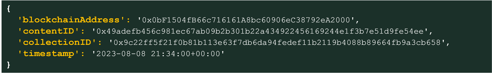

# 🧾 How to Use the vBase Stamper

The **vBase Stamper** records a file’s **timestamp**, **author**, and **digital fingerprint** (SHA3 hash) on a public blockchain. This metadata—known as **provenance**—provides permanent, verifiable proof of a file’s authenticity and timestamp.

## 🛠️ How to Make a Stamp  
[🎥 Watch the How-to Video](https://www.youtube.com/watch?v=wRJCNvDkKR8)

1. Visit the [vBase App](https://app.vbase.com/)  
2. Sign in or register for a free account  
3. Go to the Stamper page: [app.vbase.com/stamp](https://app.vbase.com/stamp)  
4. Click **“Browse for File”** and select your file  
5. *(Optional)* Check the box if the file belongs to a **Collection**  
6. *(Optional)* Select or create the relevant Collection  
7. Click **“Make a Stamp”**

## ⛓️ What Happens When You Stamp a File

When you click **“Make a Stamp”**, the following process occurs:

- Your file’s **SHA3 hash** (also called the content ID) is calculated locally in your browser  
- This hash is published to a **public blockchain**, where it’s permanently recorded  
- A **timestamp** is returned, reflecting when the blockchain included your content ID  
- This becomes an **independently verifiable record** of your file’s existence and integrity  

🔒 **The following data is recorded on-chain:**

- **Blockchain Address**: Your vBase account’s public blockchain address  
- **Content ID**: The file’s SHA3 hash, serving as its unique digital fingerprint  
- **Collection ID** *(if applicable)*: The identifier of the Collection the file belongs to  
  

 
> 💡 **Note:** vBase does not publish or share your actual file, filename, or personal information on-chain. Only cryptographic identifiers are recorded to preserve privacy and ensure long-term verifiability.

## 🗂️ What Is a Collection?

A **Collection** groups related files—such as portfolios, observations, documents, data points, or project files—under a single identifier. When a file is stamped with a Collection, the blockchain record reflects that relationship, and this relationship itself becomes verifiable.

### Why Use Collections?

- 📦 **Dataset Integrity**: Prove a file was part of a specific group (e.g. a portfolio belongs to a particualr strategy, or an observation belongs to a particular experiment)  
- ✅ **Collection Verification**: Validate the completeness of a Collection. Using Collection stamping, you can assure a verifier that they're seeing all the data associated with a particualr Collection, and no extra or missing data.   
- 🧩 **Better Organization**: Track provenance across a project, experiment, strategy, or dataset

> 📌 **Tip:** Collections are optional. Files not in a collection are still independently verifiable.

## 🔐 File Backups and Data Integrity

By default, vBase saves a **secure backup** of your file to help prevent data loss.  
You can enable or disable this setting in your [**Account Settings**](https://app.vbase.com/profile/#account_settings) under your profile.

> ⚠️ **Important:** If backups are disabled, be sure to store your file safely. If the file is lost or changed, its provenance can no longer be verified.

## 💬 Quick FAQs

### ❌ Can a Stamp Be Revoked?

No. Blockchain stamps are **permanent and immutable**.  You can stamp a new version of a file, but existing stamps cannot be changed or deleted. 

### ✅ How Do I Verify a Stamped File Later?

You’ll need the **original file** and access to the blockchain record.  Follow the guide here: [How to Verify a Stamped File](/how-to-use-vbase-verify.md)

## 📝 Additional Notes

- Your file’s content ID (aka hash) is calculated **locally in your browser**. If backup is disabled, your file is **never uploaded** or seen by vBase  
- [🔗 View a sample stamp](https://polygonscan.com/tx/0xe7dbb99c2f521a5c636d4cc7f6fd3c60cdf427c284230aa0093faac338b9d651) on Polygonscan  
- Stamps are stored on the **Polygon blockchain** and can be independently verified using tools like **Dune Analytics** or by querying Polygon nodes directly  
- [🔒 SHA3](https://en.wikipedia.org/wiki/SHA-3) is a widely trusted cryptographic standard used in banking, telecom, and secure systems
