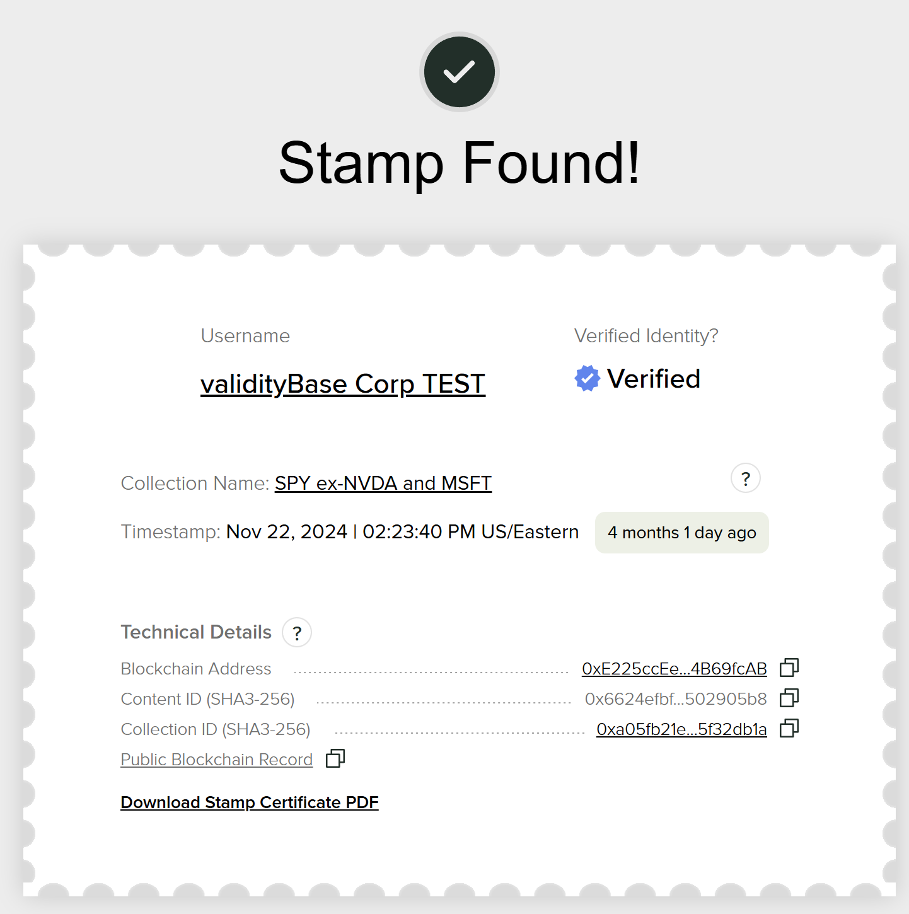

# Verify an Object

The **vBase Verify** tool checks whether a file—or its content ID (SHA3 hash)—has previously been stamped on the blockchain using vBase. If a match is found, the app displays the full stamp details, including the timestamp, blockchain address, and other stamp details.

## How to Verify a Stamp
For a quick overview, [🎥 Watch the How-To Video](https://youtu.be/nzbC3UphfGM)

#### Step-by-Step Instructions
1. Visit [vBase Verify](https://app.vbase.com/verify)  
2. Select the file you want to verify  
3. The app calculates the file’s content ID (SHA3 hash) in your browser  
4. It queries the blockchain (currently Polygon) for any stamp matching that content ID  
5. If a match is found, full stamp details are displayed

## What Happens Behind the Scenes

When you verify a file:

- The **SHA3 hash** (also called the content ID or digital fingerprint) is calculated **locally in your browser**  
- vBase uses this content ID to search for matching stamp transactions on the relevant blockkchains (currently Polygon)
- If a match is found, the app retrieves and displays the following **on-chain stamp metadata**:

  - 📅 **Timestamp** – When the stamp was recorded on-chain  
  - 👤 **Blockchain Address** – The wallet that created the stamp  
  - 🧩 **Content ID** – The SHA3 hash (aka digital fingerprint) representing the file  
  - 🗂️ **Collection ID** – If the file was part of a collection  
  - 🔗 **Transaction Hash** – The ID of the transaction in which the stamp was published

> 💡 This information is pulled directly from the blockchain and is independently verifiable.

In some cases, **additional details**—such as the vBase **Username**, **Collection Name**, or **Identity Verification Status**—may also be shown. These fields are **off-chain metadata** stored in the vBase database and displayed only when available.

<figure>
    
    <figcaption>Example of vBase Verify Output</figcaption>
</figure>

## User Notes

- Your file’s hash is always calculated **locally in your browser**  
- The file itself is **never uploaded** or seen by vBase during verification
- All stamps are currently recorded on the **Polygon blockchain** and are independently verifiable  
- Advanced users can query stamps directly via tools like Dune, Polygonscan, or publicly available Polygon nodes

## Frequently Asked Questions

#### What If My File Doesn’t Match?

Even a **1-character or 1-byte change** to a file will produce a completely different content ID.

This means:

- The file must match **exactly**—bit-for-bit—with the originally stamped version  
- If you've re-saved, edited, or reformatted the file in any way, the hash will not match  
- You can calculate the SHA3 hash locally using tools like `sha3sum`, `openssl`, or browser-based hash calculators to compare with the content ID. A few public calculators are available [here](https://emn178.github.io/online-tools/sha3_256_checksum.html) and [here](https://www.browserling.com/tools/sha3-hash). 

#### Can I Verify a Content ID Without Loading a File?

Yes! If you already know your file’s **SHA3 hash**, you can paste it into the **"Verify by Content ID"** field:

1. Go to [vBase Verify](https://app.vbase.com/verify/?method=hash)  
2. Click **"Verify by Hash"**  
3. Paste the SHA3 hash (hex format, e.g., `0xabc123...`)  
4. The app will search for a match and display any corresponding stamp

#### How Are Collections Handled?

If the file was originally stamped as part of a **Collection**, the Verify app will:

- Display the **Collection ID** associated with the file  
- Show the **Collection Name**, if available

> 📌 This is especially useful when verifying which files belong to specific projects, datasets, or deliverables.

#### Can multiple people stamp the same file?
Yes. If a user stamps the same file twice or two users stamp an identical file, it will produce the same content ID. The blockchain will show multiple transactions for that content ID, each with its own timestamp and blockchain address. For real-world data with any reasonable amount of entropy, this is extremely unlikely. 

#### Is there an API for verification?
Yes, see the Python SDK samples for verifying via the API. 

#### What happens if a stamp is deleted from vBase?
Stamp records on the **blockchain are permanent**. If the original copy of the file is lost, then the associated Stamp will not be verifiable, however it will still be visible on-chain. 

## Need Help?

- 📖 [How to Stamp a File](how-to-use-vbase-stamper.md)  
- 🧩 [What Is a SHA3 Hash?](https://en.wikipedia.org/wiki/SHA-3)  
