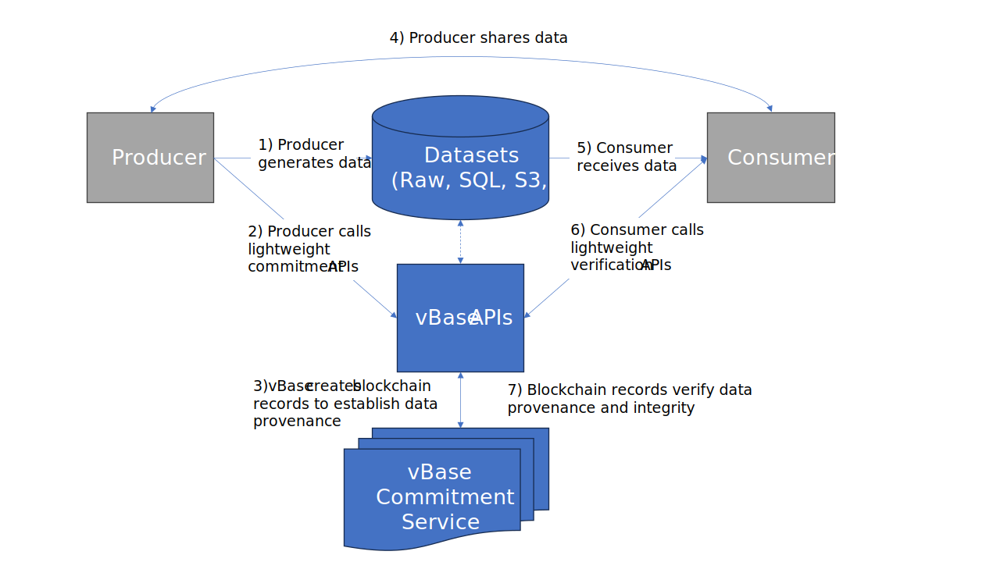

# How vBase Works

## What is a vBase Stamp

vBase operates by creating eternally verifiable cryptographic commitments that we call vBase Stamps.&#x20;

A vBase Stamp includes the following:

1. The unique ID of the user making the stamp
2. A cryptographic hash of the underlying data records (we call this a content ID)
3. A cryptographic hash of the dataset name to which the record belongs (setHash)

This encrypted information is published to a public blockchain. Thus, the stamp is assigned an **immutable tamper-proof timestamp** corresponding to the time it was added to the chain. &#x20;

Here is a graphical example of a vBase Stamp&#x20;

<figure><figcaption></figcaption></figure>

## High-level overview of the vBase process

vBase serves as an easy button for creating and validating cryptographic commitments. The following chart illustrates a typical vBase data production and validation process:

<figure><figcaption>
The vBase Process
</figcaption></figure>

A few comments on each step of the process below:&#x20;

1. vBase does not interfere with the existing data production process. Producers generate and store data using their established processes and systems.
2. When producers wish to establish data provenance, they call lightweight vBase commitment APIs. The APIs can receive data content IDs (fingerprints, hashes) or be granted read access to the data to perform all the necessary operations automatically.
3. The vBase commitment service records content IDs and timestamps that establish data integrity and provenance while preserving privacy. The service is provided by a smart contract running on a blockchain, making the resulting commitments highly secure and tamper-proof and enabling long-term validation by any party.
4. vBase does not disrupt the existing data sharing and distribution processes. Producers can continue sharing data with consumers using their familiar processes without interference. Similarly, vBase respects consumers' data access and does not disturb their established procedures.
5. Likewise, vBase does not interfere with consumers' data access.
6. Consumers seeking to validate data and establish its provenance can easily achieve this through the lightweight vBase verification APIs.
7. These APIs perform data checks against the recorded commitments, thereby validating what data was known in the past and precisely when it became known.

By adopting vBase, organizations can ensure data provenance and maintain their data's reliability and security without disrupting their current workflows. This non-intrusive approach guarantees data integrity while preserving user privacy, ultimately enhancing trust and accountability throughout the data lifecycle.
