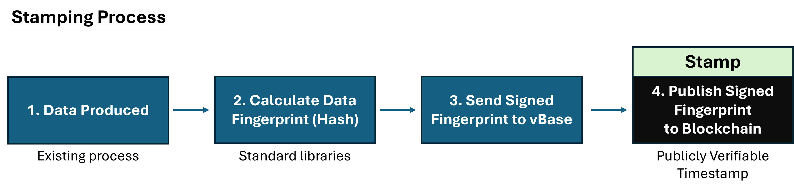
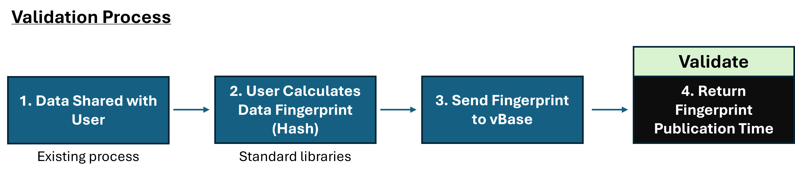

# What Is a Stamp?

A **stamp** is a cryptographic proof that a piece of data or a file existed — exactly as it was — at a particular point in time. Think of it as a method of data notarization. 

Each vBase stamp records a **fingerprint** of your data immutably on a public blockchain, creating a verifiable timestamp showing when the data existed and which dataset (known as a Collection) it belongs to. 

This provides a transparent audit trail for datasets, models, and trading strategies — turning “trust me” into “verify it yourself.”

## Why Stamps Matter

Data is constantly changing. Records are cleaned, adjusted, or re-released; model results evolve with new inputs.
Without a verifiable record of *what was known, when*, investors and clients who analyze historical data can’t be sure they're seeing the same information that actually existed at that point-in-time. 

A vBase stamp solves this by giving data a **publicly verifiable timestamp** — proving exactly when the data was produced. 

## How a Stamp Works

<picture></picture>

 

<picture></picture>

**Step-by-step:**

1. **Compute** a cryptographic fingerprint (hash) of your data, portfolio or model output using a standard hash, like SHA3-256.
2. **Write** the hash to a blockchain, creating an immutable transaction timestamp attested to by 1000s of nodes all over the world. 
3. **Verify** later when this data existed by comparing its hash to the timestamped blockchain record. 

## What a Stamp Contains

Each vBase stamp publishes three elements to the blockchain:

| Field                          | Description                                                                                                                   |
| ------------------------------ | ----------------------------------------------------------------------------------------------------------------------------- |
| **Address**                    | The blockchain address (identity) of the stamping account.                                                                        |
| **Hash**                       | A cryptographic fingerprint (SHA-3) of the data being stamped. This ensures the content can be verified without revealing it. |
| **Collection ID** *(optional)* | A fingerprint of the Collection (dataset) name. Groups related stamps together (e.g., all updates for a dataset or strategy).                                                 |

These components form a an immutable public record — a proof of existence that can be independently verified and used to prove a dataset's timestamps, completeness and impartial presentation.

A graphical example of a vBase stamp: 

<picture></picture>

## Verifying a Stamp

To verify a stamp, a user with a copy of the data:

1. Computes the hash of the data.
2. Retrieves the corresponding on-chain stamp via vBase tools or the public smart contract.
3. Confirms the timestamp on chain is the same or earlier than the claimed creation or publication date of the data.
4. (optional) Confirms each file in a dataset contains a corresponding blockchain stamp in a Collection.  

vBase automates this through its **validation API** and **web tools.** 

## Security and Trust Model

* **Immutable Ledger:** All stamps are anchored to a public blockchain (Polygon) — ensuring permanent, verifiable timestamps.
* **Privacy Preserved:** Only the hash, not the data itself, is published; sensitive content never leaves your control.
* **Tamper Detection:** Any alteration to the data — even a single byte — changes the fingerprint, immediately exposing any revisions.
* **Independent Verifiability:** Anyone can verify a stamp using the blockchain record; they don't need to rely on vBase. 

## Best Practices

* Stamp both **raw and derived** data (original inputs and model outputs).  
* Use **Collections** to group related data (e.g., “Mean Reversion Signal” or “Sentiment Scores”).  
* Keep a secure copy of every file you stamp. These originals are what you’ll use later to prove exactly what data existed at the time of stamping.  
  - The web application stores a copy by default, unless this option is disabled by the user.  
  - When using the API, you can enable the `storeStampedFile` flag to have vBase retain a copy on your behalf.  
* For track-record verification, vBase supports stamping and displaying structured data — see [**Building a Verified Track Record**](../getting-started/verified-track-record.md).

## Frequently Asked Questions

**Do I need to deal with cryptocurrencies?**
No. vBase pays blockchain transaction costs on your behalf, so you don’t need crypto to use it.

**Can I delete or replace a stamp?**
No, stamps are permanent, but you can issue a new one for revised data.

**What if my data changes after stamping?**
The fingerprint will differ. If you publish the fingerprint of the revised data, it will be clear when the data changed. 

**Is my data exposed?**
No, only the hash is public. The content itself remains private. A hash is a 256-bit data fingerprint which cannot be used to reconstruct the original data. 

## Next Steps

Ready to explore more?

- [**Try Stamping Your First Dataset**](../getting-started/start-your-journey.md) — walk through your first end-to-end stamping example.  
- [**Learn How Verification Works**](../getting-started/verification-methods.md) — see how vBase proves data integrity and timestamps on-chain.  
<!-- - [**Explore Collections**](./what-is-a-collection/) — learn how stamps are grouped to represent complete datasets or strategies.  -->
- [**See Example Use Cases**](../welcome/example-use-cases.md) — discover how data providers, model builders, researchers and others use vBase in practice.  

